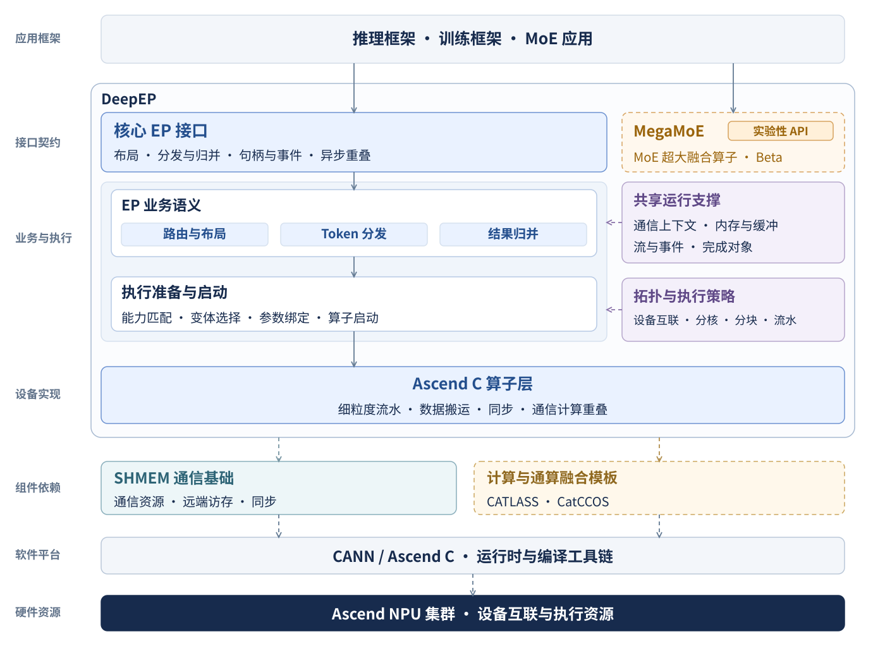

<!--
Copyright (c) 2026, Lu Lu
Modified by Joyce_An 2026
-->

# DeepEP

---

简体中文 | [English](readme_en.md)

**DeepEP 昇腾版本**（`Ascend/DeepEP`）是面向 Ascend NPU 混合专家模型（Mixture-of-Experts，MoE）推理的专家并行（Expert Parallelism，EP）通信库，提供高吞吐 **Prefill**、低时延 **Decode** 通信，以及实验性 **MegaMoE** 融合推理。

## 最新进展

---

**DeepEP V2 昇腾版。** Prefill 与 Decode 共用 `deep_ep.ElasticBuffer` 接口，通过 `dispatch()` 和 `combine()` 完成 token 分发与结果归并。

### 新增特性

- **高吞吐 Prefill：** 基于 URMA 的 dispatch/combine，集成 notify 与 Server 级 token 去重，支持 EP32/64/128/256；具体支持范围见 [Elastic 文档](docs/elastic.md)。
- **低时延 Decode：** 通过同一 V2 接口提供小批量 dispatch/combine，覆盖 EP64/128。
- **MegaMoE Prefill（实验性）：** W4A8 通信与专家计算融合，覆盖 EP32/64/128。
- **MegaMoE Decode（实验性）：** 小批量 W4A8 融合推理，覆盖 EP64/128，与 Prefill 共用同一个 MegaMoE 前向入口。

### 架构

DeepEP 通过 V2 接口连接推理框架与昇腾通信算子；MegaMoE 将 token 通信、专家计算、激活和量化整合为融合前向流程。

<p align="center">
  <a href="figures/architecture.svg">
    
  </a>
</p>

```text
DeepEP/
├── deep_ep/
│   ├── buffers/             # Python 接口
│   └── utils/               # 事件与公共工具
├── csrc/
│   ├── bindings/            # Python/C++ 绑定
│   ├── runtime/             # 通信资源与生命周期
│   ├── ops/                 # Host 校验与算子启动
│   └── kernels/             # Ascend C 通信算子
├── experiments/
│   ├── megamoe/             # MegaMoE 融合推理
│   └── ep_gmm_fused/        # 通信与矩阵乘融合算子
├── cmake/                   # 构建与安装
├── third-party/             # 依赖组件
├── configs/                 # 部署与执行配置
├── tests/                   # 正确性与回归测试
├── benchmarks/              # 性能测试
├── examples/                # 集成示例
├── docs/                    # 详细文档
└── figures/                 # 架构与性能图
```

模块职责见[架构文档](docs/architecture.md)。

## 快速开始

---

### 环境要求

| 组件 | 要求 |
| --- | --- |
| 平台 | Linux、Ascend950、CANN 9.2.0 |
| Python | ≥ 3.11 |
| 构建工具 | C++17、CMake ≥ 3.20、Make 或 Ninja、Ascend C/Bisheng |
| 框架 | PyTorch 与 `torch_npu` |
| 通信 | [dependencies.lock.json](dependencies.lock.json) 固定版本的 SHMEM；URMA 运行时 |
| MegaMoE | CATLASS；依赖配置见 [MegaMoE 文档](experiments/megamoe/README.md) |

### 安装 SHMEM 依赖

按照[构建指南](docs/build.md)准备 SHMEM SDK，加载 CANN 与 SHMEM 环境：

```bash
source /path/to/ascend-toolkit/set_env.sh
export SHMEM_ROOT=/path/to/shmem-sdk
source "$SHMEM_ROOT/set_env.sh"
export LD_LIBRARY_PATH="$SHMEM_ROOT/lib:${LD_LIBRARY_PATH:-}"
```

### 开发

```bash
python -m pip install -r requirements-dev.txt
python -m pytest tests/elastic/test_dispatch.py tests/elastic/test_combine.py -q
```

贡献要求见 [CONTRIBUTING.md](CONTRIBUTING.md)，NPU 测试命令见[测试说明](tests/README.md)。

### 安装

```bash
git clone https://gitcode.com/Ascend/DeepEP.git
cd DeepEP
export DEEPEP_NPU_ARCH=Ascend950
python -m pip install -r requirements-build.txt
python -m pip install -v --no-build-isolation --no-deps .
```

发行包名为 `ascend-deepep`，Python 导入名为 `deep_ep`。Wheel 打包和多机安装见[构建指南](docs/build.md)。

### 安装 MegaMoE

在匹配 Torch/torch_npu 的环境中加载 CANN 9.2.0 后运行：

```bash
bash experiments/megamoe/scripts/build.sh
```

脚本准备依赖并构建、安装启用 MegaMoE 和 timer 的 wheel，日常重编复用已校验的 SHMEM。直接使用 `pip wheel` 时默认不构建 MegaMoE。多机配置和验证步骤见 [MegaMoE 使用说明](experiments/megamoe/README.md)；设备编译、精度与性能仍待验收。

## 接口与示例

---

| 场景 | 接口 |
| --- | --- |
| DeepEP Prefill / Decode | `deep_ep.ElasticBuffer.dispatch()` / `combine()` |
| MegaMoE Prefill / Decode（实验性） | `deep_ep_experimental.megamoe.fp8_fp4_mega_moe()` |

### Buffer 初始化

以下为 HT 初始化片段，假定已设置 NPU 设备和 SHMEM endpoint，且 `max_tokens_per_rank > 256`：

```python
from deep_ep import ElasticBuffer

buffer = ElasticBuffer(
    rank=rank,
    world_size=ep_size,
    num_max_tokens_per_rank=max_tokens_per_rank,
    hidden=7168,
    num_topk=6,
    use_fp8_dispatch=False,  # FP8 输入时设为 True。
    explicitly_destroy=True,
)
```

LL 需显式设置 `num_bytes=8 << 30` 并使用不大于 256 的 token 上限，其他条件见 [Elastic 文档](docs/elastic.md)。使用结束后，各 rank 集体调用 `buffer.destroy()`。

### Dispatch/Combine 示例

以下示例使用目标仓的 `ElasticBuffer` 接口组织 HT forward/backward。`dispatch()` 支持 BF16 Tensor，
或 `(FP8 E4M3FN payload, FP32 per-128 scales)` 元组；`combine()` 使用匹配的 `EPHandle` 归并结果。

```python
from typing import Optional, Tuple, Union

import torch

from deep_ep import ElasticBuffer, EPHandle, EventOverlap


def dispatch_forward(
    x: Union[torch.Tensor, Tuple[torch.Tensor, torch.Tensor]],
    topk_idx: torch.Tensor,
    topk_weights: torch.Tensor,
    num_experts: int,
    num_max_tokens_per_rank: int,
    expert_alignment: int = 1,
) -> Tuple[
    Union[torch.Tensor, Tuple[torch.Tensor, torch.Tensor]],
    Optional[torch.Tensor],
    Optional[torch.Tensor],
    EPHandle,
    EventOverlap,
]:
    """将 token 分发到各 rank 的本地专家布局。"""
    return buffer.dispatch(
        x,
        topk_idx=topk_idx,
        topk_weights=topk_weights,
        num_experts=num_experts,
        num_max_tokens_per_rank=num_max_tokens_per_rank,
        expert_alignment=expert_alignment,
        async_with_compute_stream=True,
    )


def dispatch_backward(
    grad_recv_x: torch.Tensor,
    grad_recv_topk_weights: Optional[torch.Tensor],
    handle: EPHandle,
) -> Tuple[torch.Tensor, Optional[torch.Tensor], EventOverlap]:
    """Dispatch 的 backward 使用 combine 回传输入及权重梯度。"""
    return buffer.combine(
        grad_recv_x,
        handle=handle,
        topk_weights=grad_recv_topk_weights,
        async_with_compute_stream=True,
    )


def combine_forward(
    x: torch.Tensor,
    handle: EPHandle,
) -> Tuple[torch.Tensor, EventOverlap]:
    """使用 dispatch 返回的 handle 归并专家输出。"""
    combined_x, _, event = buffer.combine(
        x,
        handle=handle,
        async_with_compute_stream=True,
    )
    return combined_x, event


def combine_backward(
    grad_combined_x: torch.Tensor,
    handle: EPHandle,
) -> Tuple[torch.Tensor, EventOverlap]:
    """Combine 的 backward 使用 cached dispatch 重新分发梯度。"""
    grad_x, _, _, _, event = buffer.dispatch(
        grad_combined_x,
        handle=handle,
        async_with_compute_stream=True,
    )
    return grad_x, event
```

使用 `EventOverlap` 管理通信流和计算流的依赖：

```python
recv_x, recv_topk_idx, recv_topk_weights, handle, event = dispatch_forward(...)

# 此处可执行与本次 dispatch 输出无依赖的计算。

event.current_stream_wait()
# 等待完成后再使用 recv_x、recv_topk_idx 和 recv_topk_weights。
```

### MegaMoE 示例

MegaMoE 将 token 分发、两次专家矩阵计算、SwiGLU、量化和结果归并融合为一次前向调用。Prefill 与 Decode 共用以下接口。

下面展示 FP8 输入、FP4 权重、每卡 1 个共享专家的集成流程。通过 `torchrun` 启动，所有 rank 设置相同的 `DEEPEP_SHMEM_ENDPOINT=tcp://<主节点IPv4>:<空闲端口>`，端口与 `MASTER_PORT` 分开。
模型需提供当前 NPU 上的 `x_fp8`、`x_sf`、`topk_idx`、`topk_weights`，以及原始 ND 布局的路由和共享专家 `(weight, scale)` 权重对；形状与类型见 [MegaMoE 输入和权重布局](experiments/megamoe/README.md)。

```python
import os
import torch
import torch_npu  # 注册 NPU 后端
from deep_ep_experimental.megamoe import (
    StoreGroup, SymmBuffer, fp8_fp4_mega_moe, transform_weights_for_mega_moe,
)

torch.npu.set_device(int(os.environ["LOCAL_RANK"]))
group = StoreGroup.from_env()
try:
    # 初始化一次：384 个路由专家，每卡额外 1 个共享专家。
    buffer = SymmBuffer(
        group, num_experts=384, num_max_tokens_per_rank=4096,
        num_topk=6, hidden=7168, intermediate_hidden=3072,
        num_shared_experts=1, mma_type="fp8xfp4",
        ranks_per_node=int(os.environ["LOCAL_WORLD_SIZE"]),
    )
    w1, w2 = transform_weights_for_mega_moe(l1_weights, l2_weights)
    shared_w1, shared_w2 = transform_weights_for_mega_moe(
        shared_l1_weights, shared_l2_weights, shared=True,
    )

    # 每次调用前填入输入：各 rank 的 num_tokens 相同，且不超过预分配上限。
    num_tokens = x_fp8.shape[0]
    buffer.x[:num_tokens].copy_(x_fp8)                 # FP8 E4M3 [B, H]
    buffer.x_sf[:num_tokens].copy_(x_sf)              # E8M0 [B, H / 32]
    buffer.topk_idx[:num_tokens].copy_(topk_idx)      # int32 [B, K]
    buffer.topk_weights[:num_tokens].copy_(topk_weights)  # FP32 [B, K]
    buffer.validate_inputs(num_tokens)  # 输入检查和准备放在性能计时之外。
    buffer.prepare(num_tokens)
    y = torch.empty((num_tokens, 7168), dtype=torch.bfloat16, device="npu")
    fp8_fp4_mega_moe(
        y, w1, w2, buffer,
        shared_l1_weights=shared_w1, shared_l2_weights=shared_w2,
    )  # 结果写入 y，返回 None。
    torch.npu.synchronize()

    # 可继续复用 buffer 和转换后的权重；所有调用完成后，各 rank 同序释放。
    group.barrier("before SHMEM teardown")
    buffer.destroy()
    group.close()
except BaseException as error:
    group.abort(f"MegaMoE: {type(error).__name__}: {error}")
    raise
```

不使用共享专家时，将 `num_shared_experts` 设为 `0`，省略共享权重的转换及传参。转换后的权重应完整保留并复用。
包含输入生成和多进程运行步骤的示例见 [example.py](experiments/megamoe/python/deep_ep_experimental/megamoe/example.py)，完整接口约束见 [MegaMoE 文档](experiments/megamoe/README.md)。

Tensor 布局、事件同步及 Buffer 生命周期见 [API 文档](docs/api.md)与 [Elastic 文档](docs/elastic.md)。

### 环境变量

| 变量 | 用途 |
| --- | --- |
| `DEEPEP_NPU_ARCH` | 构建目标：`Ascend950` |
| `SHMEM_ROOT` | SHMEM SDK 目录 |
| `DEEPEP_SHMEM_ENDPOINT` | EP 作业共享初始化 endpoint |
| `ASCEND_RT_VISIBLE_DEVICES` | 分配给作业的 NPU 设备 |

## 网络配置

---

同一个 EP 组使用共享的 SHMEM 初始化 endpoint，并配置 rank 与设备的映射。当前实现按连续 8 rank 划分逻辑 Server 进行去重；逻辑 Server 不一定与物理主机一一对应。

## 实验性分支

---

### MegaMoE

MegaMoE 将 dispatch、专家计算、激活/量化及 combine 融合为 W4A8 推理流程，覆盖 Prefill 与 Decode。配置和使用方法见 [experiments/megamoe/](experiments/megamoe/README.md)。

## 致谢

---

感谢 [DeepSeek DeepEP](https://github.com/deepseek-ai/DeepEP) 提供上游 EP 接口与工作流参考，以及参与本项目的昇腾通信和计算库贡献者。

## 许可证

---

Lu Lu 持有权利的项目内容采用 [BSD 2-Clause 许可证](LICENSE)。其他来源代码保留各自的版权声明和许可证文本。

## 引用（Citation）

---

如需引用本项目，请使用以下 BibTeX 条目：

```bibtex
@misc{ascend_deepep,
  title        = {DeepEP on Ascend},
  author       = {昇腾 DeepEP 团队},
  howpublished = {\url{https://gitcode.com/Ascend/DeepEP}}
}
```
