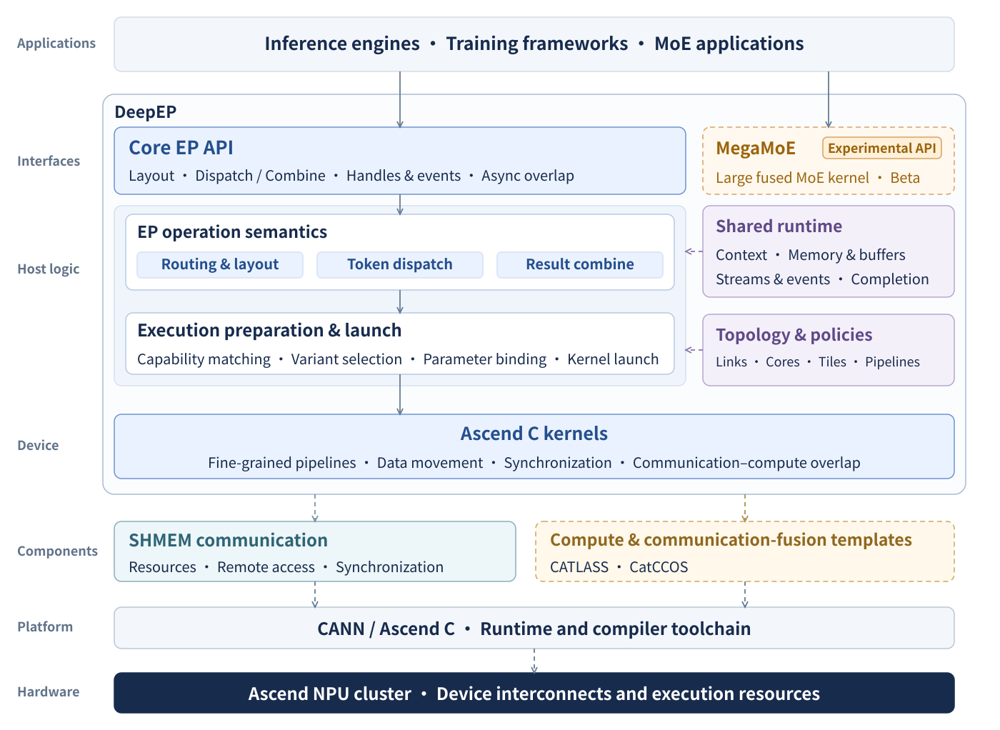

<!--
Copyright (c) 2026, Lu Lu
Modified by Joyce_An 2026
-->

# DeepEP

---

[简体中文](README.md) | English

**DeepEP on Ascend** (`Ascend/DeepEP`) is an expert-parallel (EP) communication library for mixture-of-experts (MoE) inference on Ascend NPUs. It provides high-throughput **prefill** and low-latency **decode** communication, together with experimental **MegaMoE** fused inference.

## News

---

**DeepEP V2 on Ascend.** Prefill and decode share the `deep_ep.ElasticBuffer` interface and its `dispatch()` / `combine()` operations.

### New features

- **High-throughput prefill:** URMA dispatch and combine, integrated notify, and server-level token deduplication, supporting EP32/64/128/256; see the [Elastic guide](docs/elastic.md) for the detailed support matrix.
- **Low-latency decode:** small-batch dispatch and combine through the same V2 interface for EP64/128.
- **MegaMoE prefill (experimental):** W4A8 fused communication and expert computation for EP32/64/128.
- **MegaMoE decode (experimental):** small-batch W4A8 fused inference for EP64/128, using the same MegaMoE forward entry as prefill.

### Architecture

DeepEP connects inference frameworks to Ascend communication kernels through V2. MegaMoE integrates token communication, expert computation, activation, and quantization into a fused forward workflow.

<p align="center">
  <a href="figures/architecture_en.svg">
    
  </a>
</p>

```text
DeepEP/
├── deep_ep/
│   ├── buffers/             # Python interfaces
│   └── utils/               # Events and shared utilities
├── csrc/
│   ├── bindings/            # Python/C++ bindings
│   ├── runtime/             # Communication resources and lifecycle
│   ├── ops/                 # Host validation and kernel launch
│   └── kernels/             # Ascend C communication kernels
├── experiments/
│   ├── megamoe/             # MegaMoE fused inference
│   └── ep_gmm_fused/        # Fused communication and grouped matmul
├── cmake/                   # Build and installation
├── third-party/             # Dependencies
├── configs/                 # Deployment and execution configuration
├── tests/                   # Correctness and regression tests
├── benchmarks/              # Performance benchmarks
├── examples/                # Integration examples
├── docs/                    # Detailed documentation
└── figures/                 # Architecture and performance figures
```

See the [architecture guide](docs/architecture.md) for module responsibilities.

## Quick start

---

### Requirements

| Component | Requirement |
| --- | --- |
| Platform | Linux, Ascend950, CANN 9.2.0 |
| Python | ≥ 3.11 |
| Build tools | C++17, CMake ≥ 3.20, Make or Ninja, Ascend C/Bisheng |
| Framework | PyTorch and `torch_npu` |
| Communication | SHMEM pinned in [dependencies.lock.json](dependencies.lock.json); URMA runtime |
| MegaMoE | CATLASS; dependency setup in the [MegaMoE guide](experiments/megamoe/README.md) |

### Install SHMEM dependency

Prepare the SHMEM SDK using the [build guide](docs/build.md), then load the CANN and SHMEM environment:

```bash
source /path/to/ascend-toolkit/set_env.sh
export SHMEM_ROOT=/path/to/shmem-sdk
source "$SHMEM_ROOT/set_env.sh"
export LD_LIBRARY_PATH="$SHMEM_ROOT/lib:${LD_LIBRARY_PATH:-}"
```

### Development

```bash
python -m pip install -r requirements-dev.txt
python -m pytest tests/elastic/test_dispatch.py tests/elastic/test_combine.py -q
```

See [CONTRIBUTING.md](CONTRIBUTING.md) for contribution guidelines and the [test guide](tests/README.md) for NPU test commands.

### Installation

```bash
git clone https://gitcode.com/Ascend/DeepEP.git
cd DeepEP
export DEEPEP_NPU_ARCH=Ascend950
python -m pip install -r requirements-build.txt
python -m pip install -v --no-build-isolation --no-deps .
```

The package name is `ascend-deepep`; the Python import is `deep_ep`. See the [build guide](docs/build.md) for wheel packaging and multi-node installation.

### Install MegaMoE

With matching Torch/torch_npu and CANN 9.2.0, run:

```bash
bash experiments/megamoe/scripts/build.sh
```

The script prepares dependencies and builds and installs a wheel with MegaMoE and timer support. Subsequent builds reuse the validated SHMEM SDK. Direct `pip wheel` builds keep MegaMoE disabled by default. See the [MegaMoE guide](experiments/megamoe/README.md) for multi-node configuration and validation. Device compilation, accuracy and performance qualification remain outstanding.

## Interfaces and examples

---

| Workload | Interface |
| --- | --- |
| DeepEP prefill / decode | `deep_ep.ElasticBuffer.dispatch()` / `combine()` |
| MegaMoE prefill / decode (experimental) | `deep_ep_experimental.megamoe.fp8_fp4_mega_moe()` |

### Buffer initialization

The following HT initialization assumes the NPU device and SHMEM endpoint are set, with `max_tokens_per_rank > 256`:

```python
from deep_ep import ElasticBuffer

buffer = ElasticBuffer(
    rank=rank,
    world_size=ep_size,
    num_max_tokens_per_rank=max_tokens_per_rank,
    hidden=7168,
    num_topk=6,
    explicitly_destroy=True,
)
```

For LL, explicitly set `num_bytes=8 << 30` and use a token bound no greater than 256; other requirements are listed in the [Elastic guide](docs/elastic.md). Call `buffer.destroy()` collectively when finished.

### Example use in inference prefilling

`dispatch()` prepares routing metadata and distributes tokens. After local expert computation, `combine()` aggregates results using the matching `EPHandle`.

### Example use in inference decoding

Decode uses the same `ElasticBuffer` API and `dispatch()` / `combine()` methods, with a buffer configured for the selected path.

### MegaMoE example

MegaMoE fuses token dispatch, two expert matrix multiplications, SwiGLU, quantization, and combine into one forward call. Prefill and decode use the same interface.

The integration snippet below uses FP8 inputs, FP4 weights, and one shared expert per rank. Launch with `torchrun` and set the same `DEEPEP_SHMEM_ENDPOINT=tcp://<master-IPv4>:<unused-port>` on every rank, using a port distinct from `MASTER_PORT`.
The model supplies `x_fp8`, `x_sf`, `topk_idx`, `topk_weights`, and raw ND `(weight, scale)` pairs for routed and shared experts on the current NPU. See the [MegaMoE input and weight layouts](experiments/megamoe/README.md) for shapes and dtypes.

```python
import os
import torch
import torch_npu  # Register the NPU backend.
from deep_ep_experimental.megamoe import (
    StoreGroup, SymmBuffer, fp8_fp4_mega_moe, transform_weights_for_mega_moe,
)

torch.npu.set_device(int(os.environ["LOCAL_RANK"]))
group = StoreGroup.from_env()
try:
    # Initialize once: 384 routed experts and one shared expert per rank.
    buffer = SymmBuffer(
        group, num_experts=384, num_max_tokens_per_rank=4096,
        num_topk=6, hidden=7168, intermediate_hidden=3072,
        num_shared_experts=1, mma_type="fp8xfp4",
        ranks_per_node=int(os.environ["LOCAL_WORLD_SIZE"]),
    )
    w1, w2 = transform_weights_for_mega_moe(l1_weights, l2_weights)
    shared_w1, shared_w2 = transform_weights_for_mega_moe(
        shared_l1_weights, shared_l2_weights, shared=True,
    )

    # Fill inputs before each call; all ranks use the same num_tokens, within buffer capacity.
    num_tokens = x_fp8.shape[0]
    buffer.x[:num_tokens].copy_(x_fp8)                 # FP8 E4M3 [B, H]
    buffer.x_sf[:num_tokens].copy_(x_sf)              # E8M0 [B, H / 32]
    buffer.topk_idx[:num_tokens].copy_(topk_idx)      # int32 [B, K]
    buffer.topk_weights[:num_tokens].copy_(topk_weights)  # FP32 [B, K]
    buffer.validate_inputs(num_tokens)  # Validate and prepare outside the timed region.
    buffer.prepare(num_tokens)
    y = torch.empty((num_tokens, 7168), dtype=torch.bfloat16, device="npu")
    fp8_fp4_mega_moe(
        y, w1, w2, buffer,
        shared_l1_weights=shared_w1, shared_l2_weights=shared_w2,
    )  # Writes into y and returns None.
    torch.npu.synchronize()

    # Reuse the buffer and prepared weights; after all calls, release in the same order on every rank.
    group.barrier("before SHMEM teardown")
    buffer.destroy()
    group.close()
except BaseException as error:
    group.abort(f"MegaMoE: {type(error).__name__}: {error}")
    raise
```

For routed experts only, set `num_shared_experts=0` and omit shared-weight conversion and arguments. Keep the returned weight pairs intact and reuse them.
See [example.py](experiments/megamoe/python/deep_ep_experimental/megamoe/example.py) for input generation and a runnable multi-process example, and the [MegaMoE guide](experiments/megamoe/README.md) for the full interface contract.

Tensor layouts, event synchronization, and buffer lifecycle are described in the [API guide](docs/api.md) and [Elastic guide](docs/elastic.md).

### Environment variables

| Variable | Purpose |
| --- | --- |
| `DEEPEP_NPU_ARCH` | Build target: `Ascend950` |
| `SHMEM_ROOT` | SHMEM SDK directory |
| `DEEPEP_SHMEM_ENDPOINT` | Shared initialization endpoint for the EP job |
| `ASCEND_RT_VISIBLE_DEVICES` | NPU devices assigned to the job |

## Network configurations

---

Each EP group uses a shared SHMEM initialization endpoint and an explicit rank-to-device mapping. The current implementation groups consecutive sets of eight ranks into logical servers for server-level deduplication; a logical server need not match a physical host.

## Experimental branches

---

### MegaMoE

MegaMoE combines dispatch, expert computation, activation/quantization, and combine into W4A8 fused inference for prefill and decode. See [experiments/megamoe/](experiments/megamoe/README.md) for configuration and usage.

## Acknowledgement

---

We thank [DeepSeek DeepEP](https://github.com/deepseek-ai/DeepEP) for the upstream EP interface and workflow reference, and the Ascend communication and compute library contributors supporting this project.

## License

---

Project material for which Lu Lu holds the relevant rights is licensed under the [BSD 2-Clause License](LICENSE). Other source material retains its own copyright notices and license texts.

## Citation

---

Please use the following BibTeX entry to cite this project:

```bibtex
@misc{ascend_deepep,
  title        = {DeepEP on Ascend},
  author       = {Ascend DeepEP Group},
  howpublished = {\url{https://gitcode.com/Ascend/DeepEP}}
}
```
